# 租房平台项目

>❗❗❗申明：本项目是Quinn原创项目

## 项目概述
基于Spring Boot的房屋租赁管理平台，提供房源发布、租赁申请、房源管理等功能。

## 技术栈
- 后端框架：Spring Boot 3.1.5
- 模板引擎：Thymeleaf
- 数据库：MySQL 8.0
- ORM框架：MyBatis-Plus
- 前端框架：Bootstrap 5.3
- 构建工具：Maven 3.8.8

## 核心功能
1. **用户管理**  
   - 注册/登录/退出
   - 基于Session的认证机制

2. **房源管理**  
   - 房源发布/编辑
   - 图片上传功能（支持JPG/PNG）
   - 房源列表分页展示
   - 房源状态管理（可租/已租）

3. **租赁管理**  
   - 租赁申请提交
   - 申请状态跟踪（待处理/已批准/已拒绝）
   - 房东端申请审批

## 系统架构
```
└── src/main/java
    ├── controller   # 控制器层
    ├── service      # 服务层 
    ├── entity       # 数据实体
    └── resources
        ├── static   # 静态资源
        └── templates # 页面模板
```

## 系统部分功能展示

### 首页

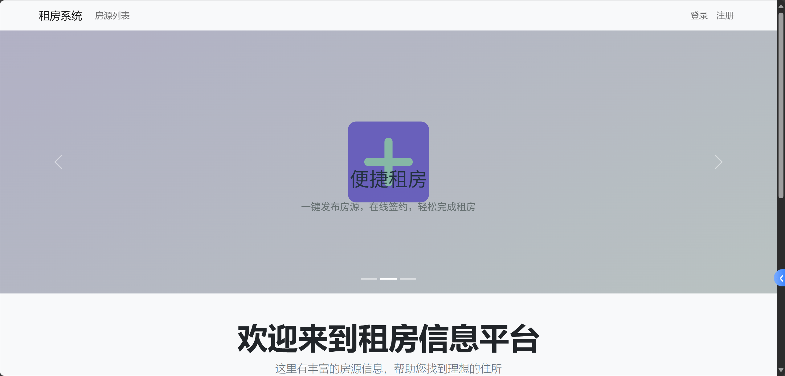

### 登陆注册

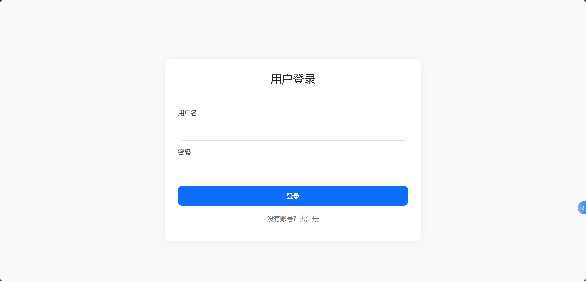

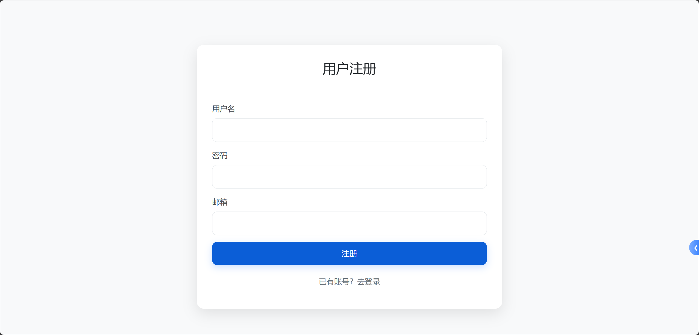


### 登陆后

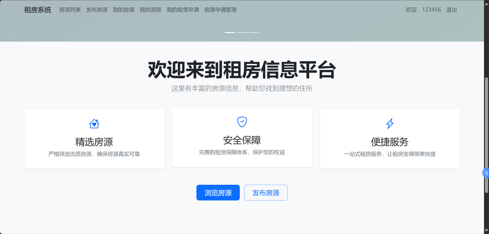

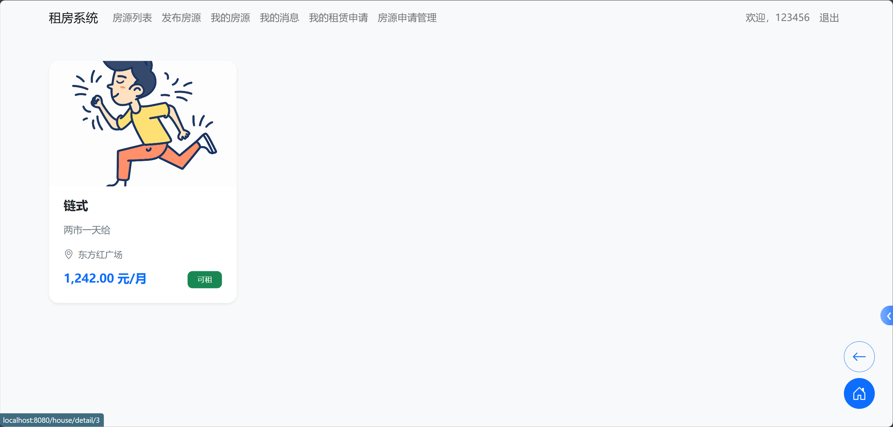

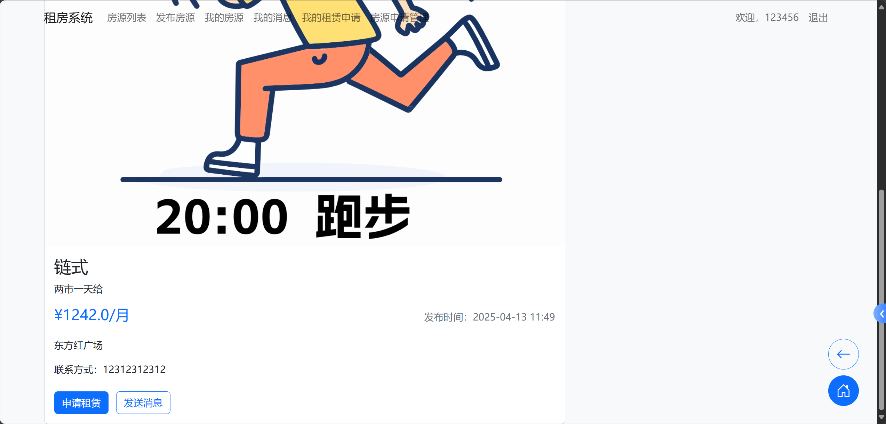

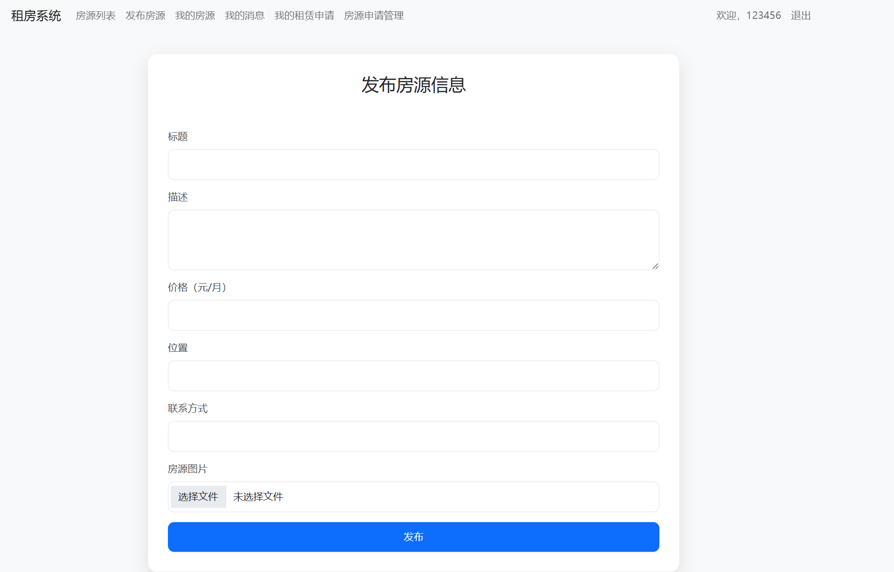


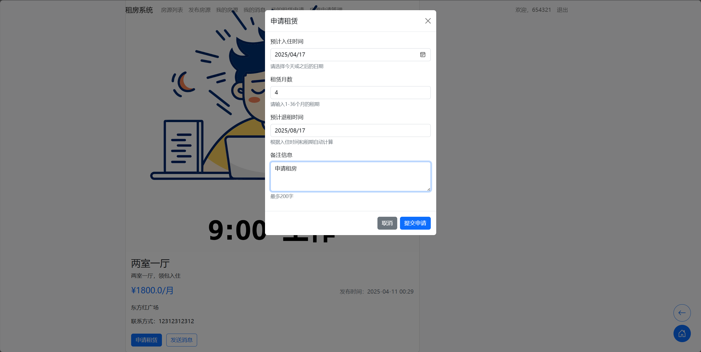

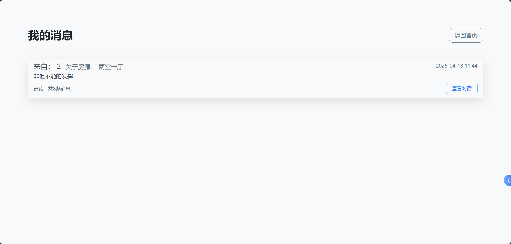

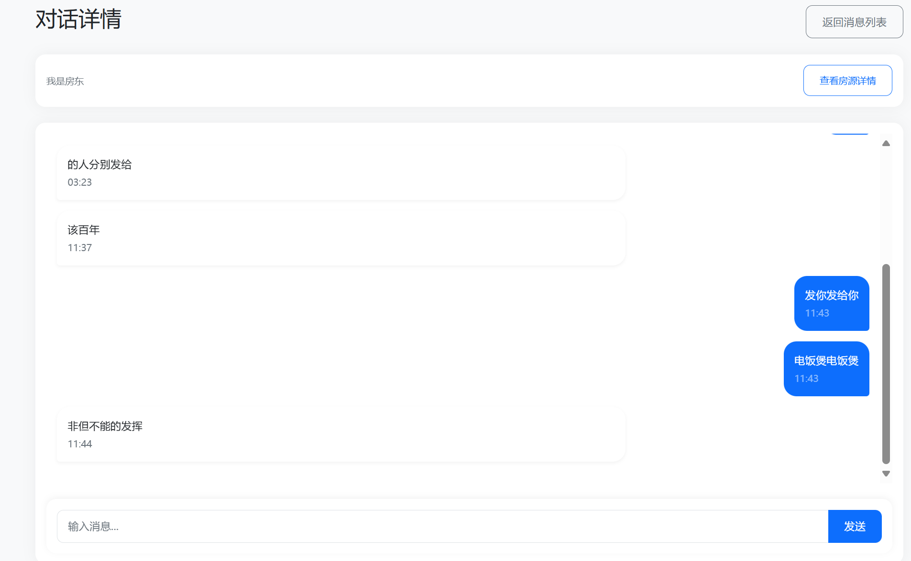

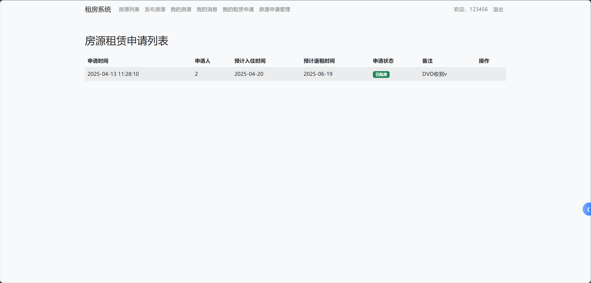

### 结语

本项目基础功能完善，且 **永久免费使用！** 🎉🥳

**But But But** 如果基础功能还无法满足你的骚操作，或者在安装部署时遇到各种玄学问题——
 **别慌！Quinn 提供以下贴心付费服务喔：**

🔧 **远程安装调试**（手残党专享 😅）
 🌟 **定制全新功能**（学霸特权 🧠）

用爱发电不易 ❤️‍🔥
 一起让项目变得更香、更强、更自由！🚀💻

>📬 **联系方式如下**（欢迎各位帅哥美女发起好友请求~ ✨）
>
>📱 **微信号**：`QuinnBox21` 
> 📧 **邮箱**：`c_qingyun2002@outlook.com` 
>
>快来添加 **Quinn** 为好友吧～一起搞事，一起变强！💪😎
>
>
